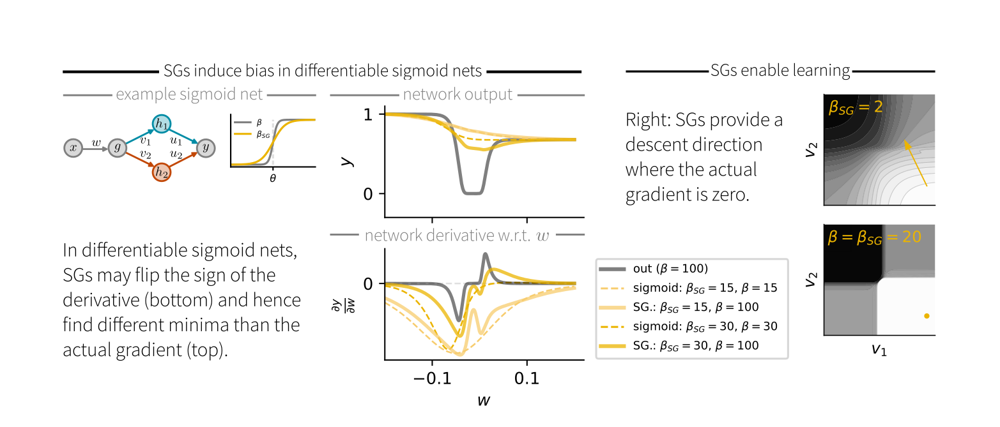

# Surrogate Gradient Theory

This repository contains the code related to the paper [*"Elucidating the theoretical underpinnings of surrogate gradient learning in spiking neural networks"*](https://arxiv.org/abs/2404.14964)

---

### Organization of the repository

The repository should have the following structure:

```bash
surrogate-gradient-theory
├── Classification
│   ├── experiments
│   │   ├── config_stork # (containing the config folders)
│   │   └── Runs # (containing the results of the experiments -> generated by wandb)
│   └── requirements.txt # required packages for the classification experiment
├── Sigmoid_network
│   ├── SG_induces_bias
│   │   ├── Plots # (not uploaded   )
│   │   └── utils
│   ├── SGs_are_not_gradients
│   │    ├── Plots # (not uploaded)
│   └── requirements.txt # required packages for the sigmoid network experiments
└── Spike_train_matching
    ├── analysis
    │   ├── Plots # (not uploaded)
    ├── experiments
    │   ├── config_experiments # (containing the config folders)
    │   ├── dataset
    │   └── Runs # (containing the results of the experiments -> generated by wandb)
    ├── utils
    └── requirements.txt # required packages for the spike train matching experiment
```

Each of the three experiments, [Classification](Classification), [Sigmoid_network](Sigmoid_network), and [Spike_train_matching](Spike_train_matching), has its own folder. The `experiments` folder contains the code to run the experiments, the `config` folder contains the configuration files for the experiments, and the `Runs` folder will be generated when running the code and then contains the results of the experiments.
In the `Classification` experiment, [wandb](https://wandb.ai) is used for visualizing, while in the `Spike_train_matching` experiment, the analysis notebooks can be found in the `analysis` folder.

Each of the three experiments has its own `requirements.txt` file, which contains the necessary packages to run the code. It can be installed via, when you are in the respective folder:

```bash
pip install -r requirements.txt
```

---

### Running the experiments

#### Classification

To run with the default configs and monitoring on your [wandb](https://wandb.ai), you first have to change the wandb [default](Classification/experiments/config_stork/wandb/default.yaml) config to contain your project and username.
Then cd to the [Classification](Classification) folder.
Install the requirements with

```bash
pip install -r requirements.txt
```

then cd to the [experiments](Classification/experiments/) folder and run the experiment with

```bash
python3 deep_convSNN.py --config-name=config
```

where `config` is the name of the config file you want to use, e.g. here [config.yaml](Classification/experiments/config_stork/config.yaml). The results will be saved in the `Runs` folder.

#### Sigmoid network

There are two experiments on the example network. As they are both jupyter notebooks, you can run them in your local environment.
Install the requirements with

```bash
pip install -r requirements.txt
```

and then run the notebooks with

```bash
jupyter notebook
```

or in your favorite jupyter environment.

#### Spike train matching

To run with the default configs, cd to the [Spike_train_matching](Spike_train_matching) folder.
Install the requirements with

```bash
pip install -r requirements.txt
```

then cd to the [experiments](Spike_train_matching/experiments/) folder and run the code with

```bash
python3 run_image_task_1hid.py --config-name=config
```

where `config` is the name of the config file you want to use, e.g. here [config.yaml](Spike_train_matching/experiments/config_experiments/config.yaml). 
The results will be saved in the `Runs` folder.

For the analysis, you can run the jupyter notebooks in the [analysis](Spike_train_matching/analysis/) folder again with
    
```bash 
jupyter notebook
```

Make sure, to update the paths in the notebooks to the correct paths of the results, if you changed them in the config.

---

### Summary of the paper

Surrogate gradients (SGs) are empirically successful at training spiking neural networks (SNNs). But we were wondering why they work so well and their theoretical basis might be.
We studied SGs in relation to two theoretical frameworks: 1) Smoothed probabilistic models, which provide exact gradients in stochastic neurons. 2) Stochastic autodifferentiation, which deals with derivatives of discrete random variables but hasn't been applied to SNNs.

While SGs are equal to the gradient of the expected output in single neurons, this equivalence breaks in deep nets. Here, SGs can be understood as smoothed stochastic derivatives, and the form of the surrogate derivative is linked to the escape noise function of the neurons.

The stochastic motivation makes SGs ideal for training stochastic SNNs. In our experiments, they achieved comparable performance to their deterministic counterparts, albeit with biologically plausible levels of trial-to-trial variability.


Curiously we also find that SGs cannot be understood as gradients of a surrogate loss. They do not result in an integral of the closed loop of zero and therefore do not correspond to a conservative field.

When comparing SGs to actual gradients in differentiable sigmoid networks, we found that the sign of the SG doesn't always match that of the actual gradient. Consequently, SG descent is not guaranteed to find a local minimum of the loss.


If you find this repository useful and use it for your research projects, please cite

<a href="https://arxiv.org/abs/2404.14964">Gygax, J., and Zenke, F. (2024).  
Elucidating the theoretical underpinnings of surrogate gradient learning in spiking neural networks.  </a>

**Bibtex Citation:**

```bibtex
@misc{gygax_elucidating_2024,
  title = {Elucidating the Theoretical Underpinnings of Surrogate Gradient Learning in Spiking Neural Networks},
  author = {Gygax, Julia and Zenke, Friedemann},
  year = {2024},
  eprint = {2404.14964},
  publisher = {arXiv},
  doi = {10.48550/arXiv.2404.14964},
}
```

---
